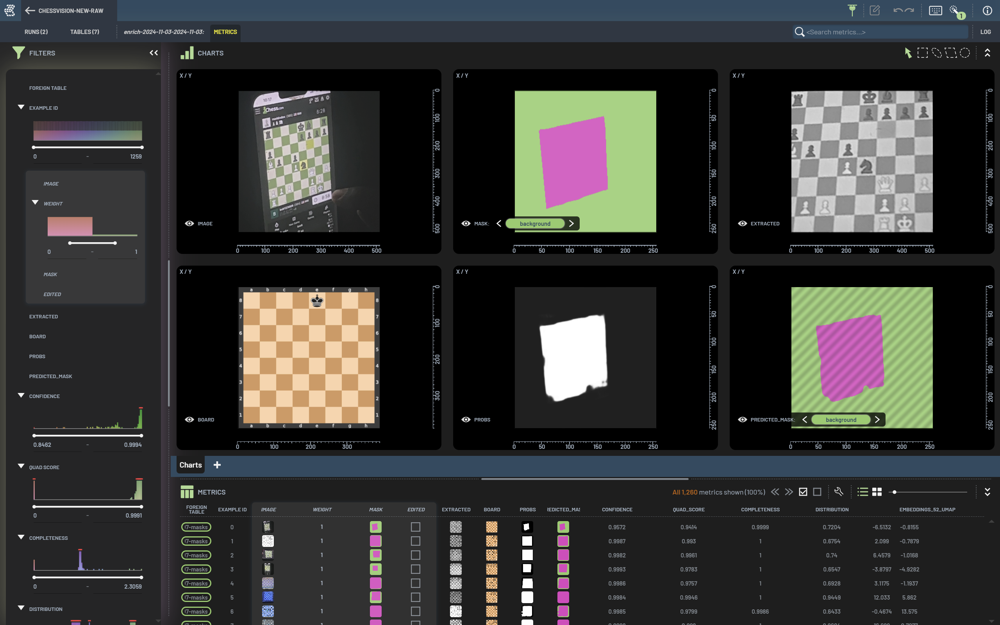
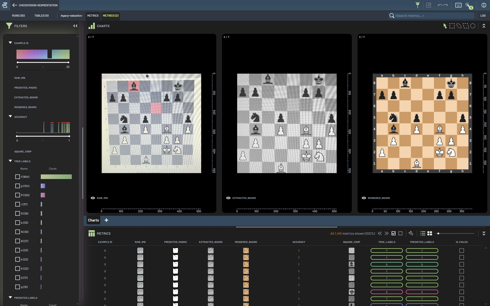

# ChessVision

Welcome to ChessVision: a computer vision system for detecting and classifying chess positions from images of 2D chessboards.
The system uses deep learning models to segment chessboards and classify chess pieces.

This project is an evolution of the original [ChessVision](https://github.com/gudbrandtandberg/ChessVision),
reimagined with the [3LC](https://3lc.ai) integrated in all stages of the pipeline. It also features a complete rewrite in PyTorch and a thorough upgrade of the codebase.

## Motivation

While detecting chess positions is certainly useful (and something I personally enjoy!),
this project serves a broader purpose as my experimental playground for exploring
machine learning systems. It's where I learn, practice, and have fun
working with:

- Data collection and annotation
- Model training and evaluation
- Performance monitoring and analysis

The [3LC](https://3lc.ai) data platform, built by the incredible team at 3LC AI, serves as a perfect tool and companion in solving many challenges, such as data selection (using metrics analysis and dataset lineage), model-assisted labeling (using the powerful 3LC Dashboard web application), evaluating and tracking model performance over time, fine tuning the training data using sample weights (resulting in faster convergence and shorter training time), and many more.

## Features

- Chessboard segmentation using a UNet model
- Chess piece classification using a YOLO model or a timm-based model
- API for image processing
- Web interface for uploading and analyzing chess images

## Project Structure

- `chessvision/`: The core computer vision code
- `scripts/`: Scripts for training and evaluating the models
- `app/`: Code for a development Flask web application and compute server
- `data/`: Training and evaluation datasets
- `weights/`: Pre-trained models (not included in the repo - train your own models or contact me for a copy)
- `tests/`: Unit tests for the computer vision code

## Installation

### 1. Clone the Repository

```bash
# Clone the repo
git clone https://github.com/gudbrandtandberg/ChessVision-3LC.git
cd ChessVision-3LC

# Initialize and update the pytorch-unet submodule
git submodule update --init
```

### 2 Install dependencies

Choose either approach:

#### Option A: Using uv (Recommended - Faster)
```bash

# Install uv on macOS and Linux.
curl -LsSf https://astral.sh/uv/install.sh | sh

# Windows: follow instructions at https://github.com/astral-sh/uv?tab=readme-ov-file#installation

# Install dependencies
uv sync --all-extras
```

#### Option B: Using venv and pip

```bash
# Create a new virtual environment
python -m venv .venv

# Activate the environment
source .venv/bin/activate

# Install in editable mode with all dependency groups
pip install -e ".[dev,viz,yolo]"
```

### 3. Set up 3LC

1. Get your API key:
   - Go to [account.3lc.ai](https://accounts.3lc.ai)
   - Copy your API key

2. Login to 3LC:
```bash
# Login with your API key
3lc login <your-api-key>

# Verify installation
3lc --version
```

## Verify Installation

```bash
# Run a simple test to verify everything is working
python -c "from chessvision import ChessVision; print('Installation successful!')"

# Verify PyTorch installation
python -c "import torch; print('CUDA available:', torch.cuda.is_available())"

# Check if mps is available
python -c "import torch; print('MPS available:', torch.backends.mps.is_available())"

# Run tests (requires trained models)
pytest tests/
```

## Examples

**Note:** You must have trained models in the weights directory to run the examples. See the [Training](#training) section for more details.

### Quick Start
s
For a quick overview of the system, run the Jupyter notebook:

```bash
code examples/quickstart-example.ipynb
```

### Detailed Pipeline

For a detailed breakdown of each step in the pipeline, run the Python script:

```bash
python examples/detailed-example.py
```

## Training

Main scripts for training and evaluating the models are located in the `scripts/` directory.

```bash
# Train the board extractor
./scripts/bin/train_board_extractor.sh --skip-eval

# Train the piece classifier
./scripts/bin/train_piece_classifier.sh --skip-eval

# Or train the YOLO classifier (recommended, requires "yolo" extra)
python ./scripts/train/train_yolo_classifier.py --skip-eval

# Now that we have trained models, we can run the evaluation suite
./scripts/bin/evaluate.sh
```

All models usually take less than 10 minutes to train on a modern GPU.
s
See additional launch configurations in `.vscode/launch.json` for training the models and
running the web application.

## The ChessVision Solution

The chessvision solution consists of several steps:

1. Board detection using a UNet model to segment the chessboard from the background
2. Contour detection and filtering to identify the chessboard boundaries
3. Perspective transform to extract the chessboard
4. Individual square extraction
5. CNN-based piece classification
6. Chess position validation and final output (FEN string)

For more details on the original approach, see the [old README](https://github.com/gudbrandtandberg/ChessVision?tab=readme-ov-file#algorithm-details)

## Datasets

The repo comes with three original datasets checked in:

- `board_extraction`: A dataset of chessboard images with annotated segmentation masks.
- `squares`: A dataset of chess piece images with annotated classification labels.
- `test`: A set of test images with ground truth files for evaluating the model.

In addition, there is a practically endless supply of new data collected through a friend's chess app, which I have in a private S3 bucket.

## 3LC and the ML Lifecycle

### Training the board extractor


### Training the piece classifier


### Process new raw data




### Run evaluation suite


